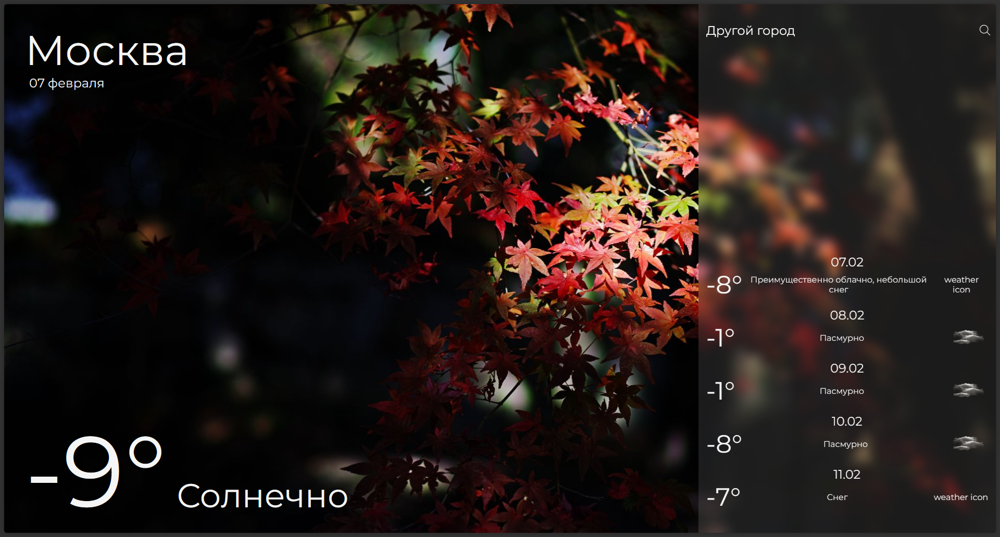
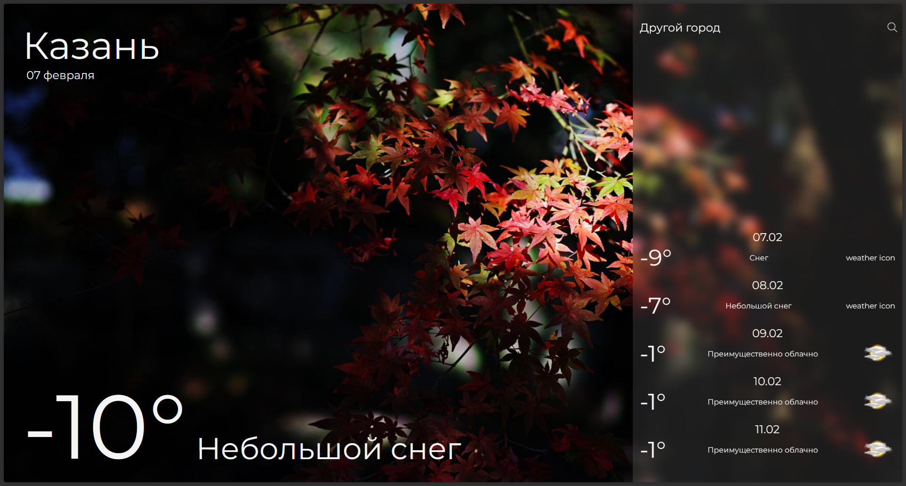

# 🌤️ Weather App

**Weather App** — это мой первый законченный учебный проект на React. Приложение показывает текущую погоду и прогноз на 5 дней для выбранного города.

## 🎯 Возможности

* Просмотр текущей погоды: температура, описание, дата.
* Прогноз на 5 дней с температурой и погодными условиями.
* Поиск любого города через API AccuWeather.

## 📷 Скриншоты

## 🛠️ Технологии

* React
* Vite
* JavaScript
* CSS
* HTML
